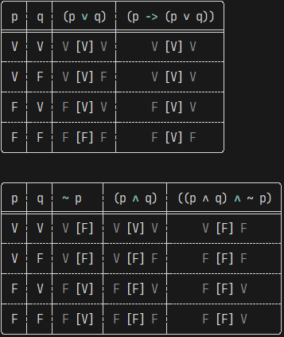

# RPLT
RPLT (Rust Propositional Logic Table) is a lightweight truth table generator for propositional logic expressions. Written in Rust, it parses logical formulas and outputs their complete truth tables. Supports operators like NOT, AND, OR, CONDITIONAL and BICONDITIONAL

# Build From Source

To build this project from source, follow these steps:

Install [Rust](https://www.rust-lang.org/tools/install).

### Building the Project
1. Clone this repository to your local machine:
```bash
$ git clone https://github.com/nowuX/rplt.git
$ cd rplt
$ cargo build
```

## Usage
```bash
$ cargo run -- table "( p and q ) -> q"
$ cargo run -- --verbose table "( q or p ) -> r"
$ cargo run -- help
```
### Output


## TODO
- [X] Support arguments with [clap](https://lib.rs/crates/clap)
  - [X] Only vars values and final result
  - [ ] Tautology, contradiction and contingency indicator (IDK)
- [X] Verbose in each operation. `p or q` -> `V [V] F`
- [X] Better display operation `~ p` to `<color>~ p`
